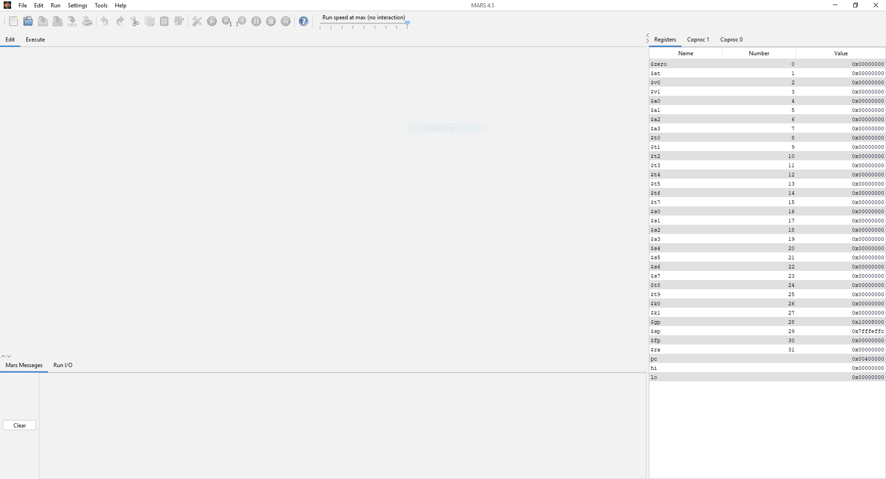
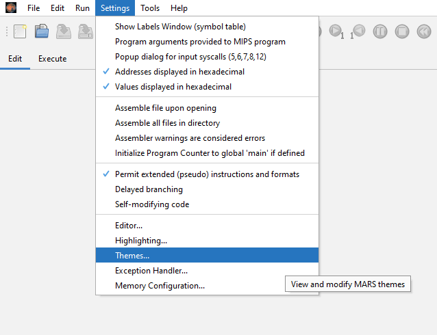
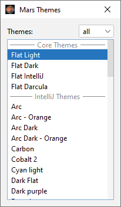
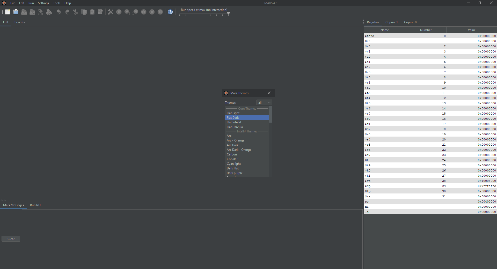
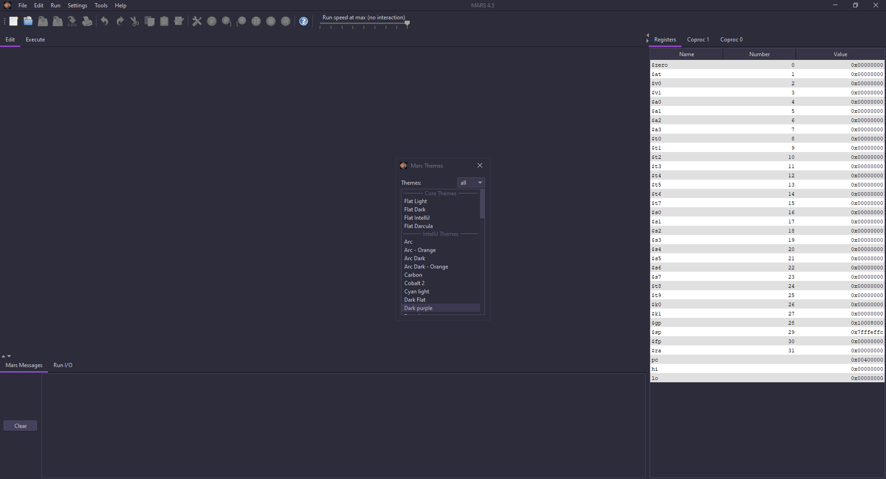
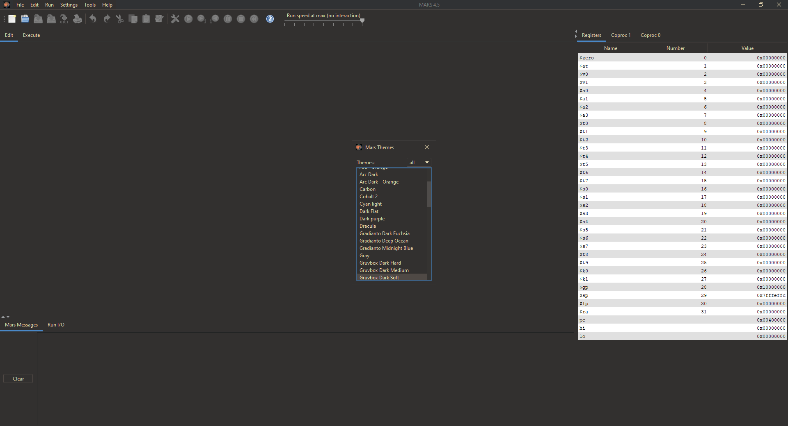
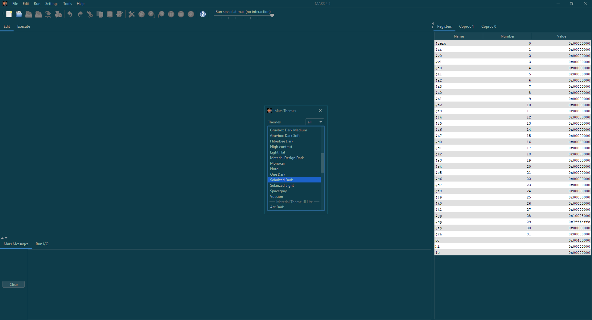

# Theme Engine for MARS (MIPS Assembler and Runtime Simulator)

Official project: [here](https://courses.missouristate.edu/KenVollmar/mars/)

<code>It's all coming back into focus!</code>

## Leave a ⭐ if you like the project!

 

This repository contains a modified, themeable version of MARS. You can see features included below, alongside with some screenshots.

## Platforms
MARS Theme Engine has been tested on:
* Windows 10 Version 10.0.19041 Build 19041
* [Ubuntu 20.04.1 LTS](https://releases.ubuntu.com/20.04.1/)
* [Arch Linux 2020-09-01](https://www.archlinux.org/releng/releases/2020.09.01/)

## What's new?
* Added a modern looking Look and Feel, [FlatLaf](https://www.formdev.com/flatlaf/). 

* Added a new menu, accessible from _Settings > Themes_

* Lots of themes to choose from! 😄

  **Flat Dark**
  

  **Dark Purple**
  

  **Gruvbox Dark**
  

  **Solarized Dark**
  

**and many more!!**

## How to install?
You have the option to: 
* Wait until this unofficial version gets added to the official version, no promises.
* Download it by downloading the "Mars4_5_1_1Unofficial.jar" file from the repository
* Download it clicking [here](https://github.com/aeris170/MARS-Theme-Engine/releases/download/v4.5.1.1/Mars4_5_1_1Unofficial.jar)